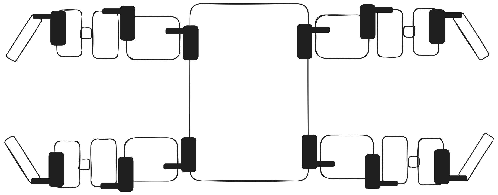
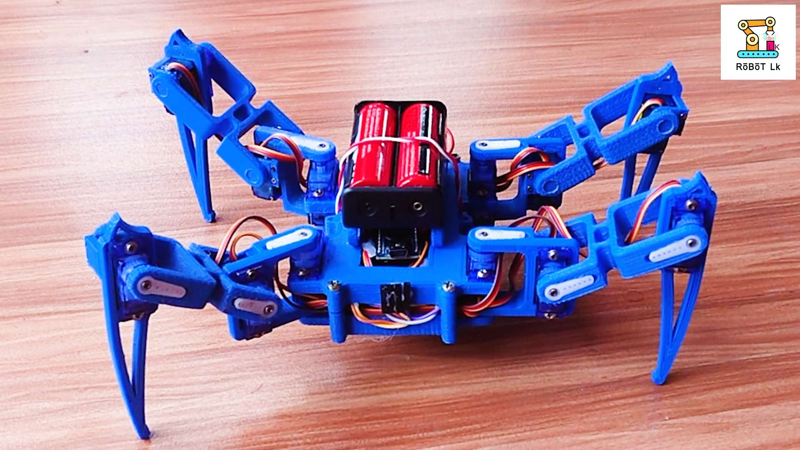

# Паук-робот

## Содержание

- [Quickstart](#quickstart)
  - [Сборка Quadro Spider с MG90S — по шагам](#сборка-quadro-spider-с-mg90s--по-шагам)
  - [Подключение сервоприводов и настройка LEG_CHANNELS](#подключение-сервоприводов-и-настройка-leg_channels)
  - [Как крепить сервоприводы](#как-крепить-сервоприводы)
  - [Питание PCA9685 (5–6 В)](#питание-pca9685-56-в)
  - [Подключение PCA9685 к Raspberry Pi по I2C](#подключение-pca9685-к-raspberry-pi-по-i2c)
  - [Требования к питанию сервоприводов](#требования-к-питанию-сервоприводов)
- [Структура проекта и файлы](#структура-проекта-и-файлы)
  - [Backend](#backend)
  - [Подключение сервоприводов к PCA9685](#подключение-сервоприводов-к-pca9685)
  - [Frontend](#frontend)
  - [Прочее](#прочее)
- [API Endpoints](#api-endpoints)
  - [Статика](#статика)
  - [API](#api)
  - [POST `/api/set_angle` — тело запроса](#post-apiset_angle--тело-запроса)
- [Лапы](#лапы)
  - [Названия суставов](#названия-суставов)
  - [Обозначение ног](#обозначение-ног)
- [Углы](#углы)
- [Автозапуск пульта и Wi‑Fi точка доступа](#автозапуск-пульта-и-wi-fi-точка-доступа)

---

## Quickstart

### Сборка Quadro Spider с MG90S — по шагам

**Что нужно**

| Деталь | Кол-во | Зачем |
|--------|--------|-------|
| Raspberry Pi 3/4 | 1 | Мозг, I2C к PCA9685 |
| PCA9685 (16-канальный PWM) | 1 | Управление 12 серво |
| MG90S (AliExpress) | 12 | 3 серво × 4 ноги |
| 18650 | 2 | Питание серво (в серии ≈ 7,4 В) |
| XLA step-up/down модуль | 1 | Стабильные 5–6 В на V+ PCA9685 |
| Провода, общий GND | — | Pi + PCA9685 + блок питания |

**Шаг 1 — Питание серво (18650 → XLA → PCA9685 V+)**

```
18650 (+) ──► 18650 (+)     (две батареи ПОСЛЕДОВАТЕЛЬНО ≈ 7,4 В)
18650 (−) ──► GND общий

XLA IN+  ◄── от + батарей
XLA IN−  ◄── GND
XLA OUT+ ──► PCA9685 V+   (5–6 В на серво)
XLA OUT− ──► GND общий

⚠️ GND Raspberry Pi = GND PCA9685 = GND XLA = GND батарей — обязательно!
⚠️ V+ PCA9685 — отдельное питание серво, НЕ от Pi!
```

Скрутка/пайка проводов от двух 18650 к XLA даёт ток, которого не хватает от USB Pi. MG90S при движении тянут до ~500 мА каждый — без XLA и мощного БП серво дёргаются или не двигаются.

**Шаг 0 — Включить I2C на Raspberry Pi (до подключения PCA9685)**

Без этого `i2cdetect` и Python-код не увидят PCA9685.

```bash
sudo raspi-config
```

В меню по шагам:

1. **3 Interface Options** (Интерфейсы)
2. **I5 I2C** (или **P5 I2C** — номер зависит от версии Raspberry Pi OS)
3. **Yes** / **\<Yes\>** — включить I2C
4. **\<Ok\>**
5. **\<Finish\>** — при запросе перезагрузки выбери **\<Yes\>**

После перезагрузки проверь, что модули загружены:

```bash
ls /dev/i2c*
# Ожидается: /dev/i2c-1

sudo i2cdetect -y 1
# До подключения PCA9685 таблица может быть пустой — это нормально
```

На старых образах вместо `raspi-config` можно так (если пункт I2C уже включён — пропусти):

```bash
echo 'dtparam=i2c_arm=on' | sudo tee -a /boot/firmware/config.txt
# или на старых системах: /boot/config.txt
sudo reboot
```

**Шаг 2 — I2C: Raspberry Pi → PCA9685**

| PCA9685 | Raspberry Pi |
|---------|--------------|
| SDA | GPIO 2 (Pin 3) |
| SCL | GPIO 3 (Pin 5) |
| GND | GND |
| VCC | 3,3 В (логика) |
| V+ | от XLA (шаг 1) |

Подключай PCA9685 **после** шага 0 (I2C уже включён в системе).

**Шаг 3 — 12 серво MG90S → каналы PCA9685**

Каждый серво: **коричневый/чёрный → GND**, **красный → V+** (или общая шина V+), **оранжевый/жёлтый → PWM-канал**.

| Нога | coxa | femur | tibia | Где на роботе |
|------|------|-------|-------|---------------|
| **FL** | 0 | 1 | 2 | передняя левая |
| **FR** | 3 | 4 | 5 | передняя правая |
| **BL** | 6 | 7 | 8 | задняя левая |
| **BR** | 9 | 10 | 11 | задняя правая |

- **coxa** — ближайший к корпусу сустав  
- **femur** — средний  
- **tibia** — голень, дальний от корпуса  

Если распаял иначе — поменяй `LEG_CHANNELS` в `backend/spider_config.py`.

**Шаг 4 — Проверка I2C**

```bash
sudo apt install i2c-tools
sudo i2cdetect -y 1
# В таблице должно быть 40 (PCA9685)
```

**Шаг 4½ — Python-зависимости (venv, обязательно на новых Raspberry Pi OS)**

На Raspberry Pi OS Bookworm и новее **нельзя** ставить пакеты через системный `pip3` — будет ошибка `externally-managed-environment` (PEP 668). Используй виртуальное окружение в папке проекта:

```bash
cd ~/spider   # или путь к проекту
chmod +x setup.sh start.sh
./setup.sh
```

Скрипт `setup.sh` один раз:
1. ставит `python3-venv` и `i2c-tools` через `apt`
2. создаёт `.venv/` в папке проекта
3. ставит зависимости из `requirements.txt`

Вручную (если без скрипта):

```bash
sudo apt install python3-venv python3-pip i2c-tools
cd ~/spider
python3 -m venv .venv
.venv/bin/pip install --upgrade pip
.venv/bin/pip install --default-timeout=100 -r requirements.txt
```

Пакеты в `requirements.txt` (имена для pip):

| pip-пакет | зачем |
|-----------|-------|
| `adafruit-circuitpython-servokit` | ServoKit / PCA9685 |
| `adafruit-extended-bus` | I2C bus 1 (`ExtendedI2C`) — **не** `adafruit-circuitpython-extended-bus` |
| `RPi.GPIO` | GPIO на Raspberry Pi |
| `flask`, `flask-cors` | веб-пульт |

**Шаг 5 — Тест каждого серво (интерактивно)**

```bash
cd ~/spider
.venv/bin/python backend/test_servos.py
```

Скрипт:
1. Проверит I2C и адрес `0x40`
2. Поставит все серво в 90°
3. По очереди повернёт каждый на +35° и спросит: «двинулся?»
4. Запишет нерабочие в `backend/servo_test_report.json`

**Шаг 6 — Запуск пульта**

```bash
cd ~/spider
./start.sh
# http://<IP-Raspberry-Pi>:5000       — простой пульт (4 кнопки)
# http://<IP-Raspberry-Pi>:5000/calibrate — настройка углов серво
```

**Шаг 7 — Автозапуск при включении Pi (опционально)**

```bash
sudo ./install-services.sh
```

Пульт и Wi‑Fi точка доступа (если нет домашней сети) стартуют сами, без логина. Подробнее — [Автозапуск пульта и Wi‑Fi точка доступа](#автозапуск-пульта-и-wi-fi-точка-доступа).

---

### Подключение сервоприводов и настройка LEG_CHANNELS

Подключите 12 сервоприводов к выходам PCA9685 в порядке, заданном в `spider_config.py` (строки 14–17):

| Нога | coxa | femur | tibia |
|------|------|-------|-------|
| FL | 0 | 1 | 2 |
| FR | 3 | 4 | 5 |
| BL | 6 | 7 | 8 |
| BR | 9 | 10 | 11 |

Если распайка другая — измените словарь `LEG_CHANNELS` в `spider_config.py` под вашу схему.

### Питание PCA9685 (5–6 В)

- **VCC** — питание логики PCA9685 (3,3 В или 5 В, совместимо с Raspberry Pi)
- **V+** — питание сервоприводов: **5–6 В** (отдельный блок питания, не от Raspberry Pi)

Общая земля (GND) между Raspberry Pi, PCA9685 и блоком питания обязательна.

### Подключение PCA9685 к Raspberry Pi по I2C

**Сначала включи I2C в системе** (если ещё не делал на шаге 0):

```bash
sudo raspi-config
# Interface Options → I2C → Enable → Finish → Reboot
```

Проводка:

- **SDA** → GPIO 2 (Pin 3)
- **SCL** → GPIO 3 (Pin 5)
- **GND** → GND
- **VCC** → 3,3 В (логика)

В `spider_config.py` задаются:
- `I2C_BUS = 1` — шина I2C (на RPi 3/4 это обычно 1)
- `PCA9685_ADDRESS = 0x40` — адрес по умолчанию

**Как узнать I2C-адрес PCA9685:**

```bash
sudo apt install i2c-tools
sudo i2cdetect -y 1
```

В таблице найдите устройство (обычно `40`). Если адрес другой — измените `PCA9685_ADDRESS` в `spider_config.py`.

### Требования к питанию сервоприводов

| Параметр | Значение |
|----------|----------|
| Напряжение | 5–6 В (по характеристикам ваших сервоприводов) |
| Ток | **≥ 2 А** (рекомендуется 3–5 А) |

Сервоприводы потребляют много тока, особенно при одновременном движении. Блок питания Raspberry Pi (≈2,5 А) для них не подходит — нужен отдельный БП. При недостаточном токе возможны сбои, «дёргания» и перезагрузки.

### Как крепить сервоприводы

Схема крепления сервоприводов к корпусу и сегментам ног:



Пример собранного робота:



---

## Структура проекта и файлы

### Backend
| Файл | Описание |
|------|----------|
| `backend/server.py` | HTTP-сервер (Flask). Раздаёт фронтенд, обрабатывает API-запросы (движение, углы, статус I2C). |
| `backend/test_servos.py` | Интерактивный тест I2C и всех 12 серво по очереди. Сохраняет отчёт в `servo_test_report.json`. |
| `backend/servo_manager.py` | Логика управления сервоприводами. Класс `ServoManager`: инициализация PCA9685, походка (вперёд/назад/влево/вправо), позы (встать, сесть, отжимание), махание лапкой. |
| `backend/spider_config.py` | Конфигурация: углы для каждой ноги и сустава, маппинг каналов PCA9685, оффсеты. Здесь менять калибровку. |

#### Подключение сервоприводов к PCA9685

В `spider_config.py` (строки 14–17) задаётся соответствие ног и суставов каналам PCA9685:

| Нога | coxa | femur | tibia |
|------|------|-------|-------|
| FL | 0 | 1 | 2 |
| FR | 3 | 4 | 5 |
| BL | 6 | 7 | 8 |
| BR | 9 | 10 | 11 |

Сервоприводы нужно подключать к выходам PCA9685 в этом порядке: FL (0–2), FR (3–5), BL (6–8), BR (9–11). При другой распайке измените значения в `LEG_CHANNELS`.

### Frontend
| Файл | Описание |
|------|----------|
| `frontend/index.html` | Простой пульт: сесть, встать, отжаться, шаг вперёд (diagonal crawl). |
| `frontend/app.js` | Логика простого пульта, блокировка кнопок на время движения. |
| `frontend/calibrate.html` | Калибровка: 12 серво, углы, тест, все направления движения. |
| `frontend/calibrate.js` | Логика страницы калибровки. |
| `frontend/style.css` | Стили обоих пультов, mobile-first. |

### Прочее
| Файл | Описание |
|------|----------|
| `image.png` | Карта углов (схема). |
| `requirements.txt` | Python-зависимости (ставятся в `.venv`, не в систему). |
| `setup.sh` | Один раз: создаёт `.venv` и ставит зависимости (`./setup.sh`). |
| `install-services.sh` | Автозапуск пульта + Wi‑Fi AP через systemd. |
| `start.sh` | Запуск сервера через `.venv/bin/python backend/server.py`. |
| `scripts/spider-ap.sh` | Точка доступа, если домашний Wi‑Fi недоступен. |
| `config/spider-ap.conf` | SSID/пароль точки доступа. |

---

## Автозапуск пульта и Wi‑Fi точка доступа

Systemd-сервисы стартуют **до логина** (на этапе `multi-user.target`) — монитор и клавиатура не нужны.

| Сервис | Что делает |
|--------|------------|
| `spider-ap` | 45 с ждёт домашний Wi‑Fi; если IP нет — поднимает точку доступа |
| `spider` | Запускает веб-пульт на порту 5000 |

### Установка (один раз)

```bash
cd ~/spider
./setup.sh
chmod +x install-services.sh start.sh scripts/spider-ap.sh
sudo ./install-services.sh
```

Скрипт сам подставит пути и пользователя в unit-файлы, добавит в группы `i2c`/`gpio`, включит автозапуск.

### Точка доступа (если домашний Wi‑Fi недоступен)

Настройки в `config/spider-ap.conf`:

| Параметр | По умолчанию |
|----------|--------------|
| `SPIDER_AP_SSID` | `Spider-Pi` |
| `SPIDER_AP_PASSWORD` | `spider1234` |
| `SPIDER_AP_WAIT_SEC` | `45` |

После загрузки без Wi‑Fi:
1. На телефоне/ноутбуке подключись к Wi‑Fi **Spider-Pi**
2. Открой **http://10.42.0.1:5000** (или IP из `journalctl -u spider-ap`)
3. SSH: `ssh georgy@10.42.0.1`

Если домашний Wi‑Fi **есть** — AP не поднимается, пульт доступен по обычному IP Pi в роутере.

### Проверка и логи

```bash
sudo systemctl status spider-ap
sudo systemctl status spider
journalctl -u spider-ap -f
journalctl -u spider -f
```

Перезапуск вручную:

```bash
sudo systemctl restart spider-ap spider
```

Отключить автозапуск:

```bash
sudo systemctl disable spider spider-ap
```

### Файлы

| Файл | Назначение |
|------|------------|
| `install-services.sh` | Установка обоих systemd-сервисов |
| `systemd/spider.service` | Шаблон автозапуска пульта |
| `systemd/spider-ap.service` | Шаблон точки доступа |
| `scripts/spider-ap.sh` | Логика AP через NetworkManager |
| `config/spider-ap.conf` | SSID и пароль точки доступа |
| `start.sh` | `.venv/bin/python backend/server.py` (без debug в systemd) |

---

## API Endpoints

Базовый URL: `http://localhost:5000`

### Статика
| Метод | Endpoint | Описание |
|-------|----------|----------|
| GET | `/` | Простой пульт |
| GET | `/calibrate` | Калибровка серво |
| GET | `/<path:filename>` | Статические файлы из `frontend/` |

### API
| Метод | Endpoint | Описание | Аргументы |
|-------|----------|----------|-----------|
| GET | `/api/angles` | Текущие углы всех сервоприводов | — |
| GET | `/api/i2c_status` | Проверка подключения PCA9685 по I2C | — |
| GET | `/api/motion_status` | `{ "busy": true/false }` — идёт ли движение | — |
| POST | `/api/set_angle` | Установить угол для сустава | JSON в теле запроса, см. ниже |
| POST | `/api/move_forward` | Один шаг вперёд (diagonal crawl FL→BR→FR→BL) | — |
| POST | `/api/move_forward_2` | Движение вперёд (низкая стойка) | — |
| POST | `/api/move_backward` | Движение назад | — |
| POST | `/api/move_right` | Шаг вправо | — |
| POST | `/api/move_left` | Шаг влево | — |
| POST | `/api/wave_fl` | Махание передней левой лапой | — |
| POST | `/api/stand_up` | Встать | — |
| POST | `/api/sit_down` | Сесть | — |
| POST | `/api/push_up` | Отжимание | — |

При повторном запросе во время движения — ответ **409** `{ "busy": true }`.

### POST `/api/set_angle` — тело запроса

`Content-Type: application/json`

| Поле | Тип | Обязательный | Описание |
|------|-----|--------------|----------|
| `leg` | string | да | Нога: `"FL"`, `"FR"`, `"BL"`, `"BR"` |
| `joint` | string | да | Сустав: `"coxa"`, `"femur"`, `"tibia"` |
| `angle` | number | да | Угол в градусах (0–180) |

**Пример:**
```json
{
  "leg": "FL",
  "joint": "femur",
  "angle": 90
}
```

---

## Лапы

### Названия суставов
- **coxa** — ближайший к корпусу
- **femur** — средний
- **tibia** — голень (дальний)

### Обозначение ног
- **FL** — передняя левая
- **FR** — передняя правая
- **BL** — задняя левая
- **BR** — задняя правая

## Углы

Карта углов показана ниже:


