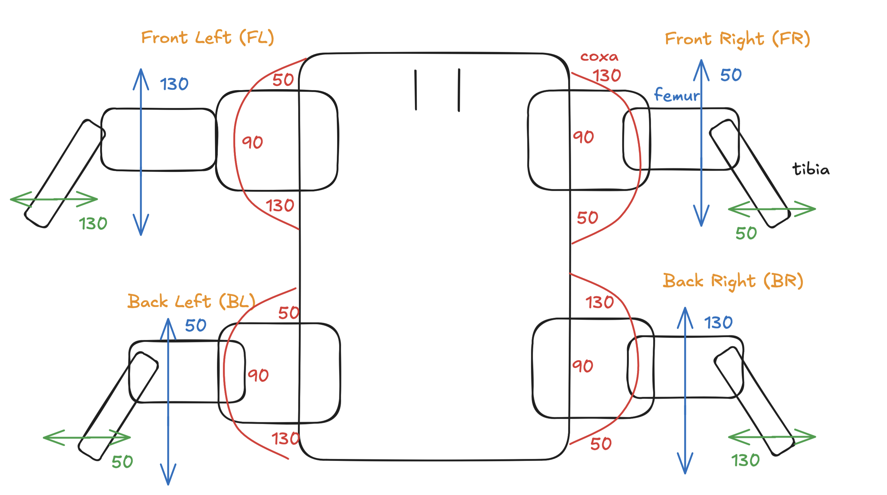

# Паук-робот

## Содержание

- [Quickstart](#quickstart)
  - [Подключение сервоприводов и настройка LEG_CHANNELS](#подключение-сервоприводов-и-настройка-leg_channels)
  - [Питание PCA9685 (5–6 В)](#питание-pca9685-56-в)
  - [Подключение PCA9685 к Raspberry Pi по I2C](#подключение-pca9685-к-raspberry-pi-по-i2c)
  - [Требования к питанию сервоприводов](#требования-к-питанию-сервоприводов)
- [Структура проекта и файлы](#структура-проекта-и-файлы)
  - [Backend](#backend)
  - [Подключение сервоприводов к PCA9685](#подключение-сервоприводов-к-pca9685)
  - [Frontend](#frontend)
  - [Прочее](#прочее)
- [API Endpoints](#api-endpoints)
  - [Статика](#статика)
  - [API](#api)
  - [POST `/api/set_angle` — тело запроса](#post-apiset_angle--тело-запроса)
- [Лапы](#лапы)
  - [Названия суставов](#названия-суставов)
  - [Обозначение ног](#обозначение-ног)
- [Углы](#углы)
- [Автозапуск сервера](#автозапуск-сервера)

---

## Quickstart

### Подключение сервоприводов и настройка LEG_CHANNELS

Подключите 12 сервоприводов к выходам PCA9685 в порядке, заданном в `spider_config.py` (строки 14–17):

| Нога | coxa | femur | tibia |
|------|------|-------|-------|
| FL | 0 | 1 | 2 |
| FR | 3 | 4 | 5 |
| BL | 6 | 7 | 8 |
| BR | 9 | 10 | 11 |

Если распайка другая — измените словарь `LEG_CHANNELS` в `spider_config.py` под вашу схему.

### Питание PCA9685 (5–6 В)

- **VCC** — питание логики PCA9685 (3,3 В или 5 В, совместимо с Raspberry Pi)
- **V+** — питание сервоприводов: **5–6 В** (отдельный блок питания, не от Raspberry Pi)

Общая земля (GND) между Raspberry Pi, PCA9685 и блоком питания обязательна.

### Подключение PCA9685 к Raspberry Pi по I2C

- **SDA** → GPIO 2 (Pin 3)
- **SCL** → GPIO 3 (Pin 5)
- **GND** → GND
- **VCC** → 3,3 В (логика)

В `spider_config.py` задаются:
- `I2C_BUS = 1` — шина I2C (на RPi 3/4 это обычно 1)
- `PCA9685_ADDRESS = 0x40` — адрес по умолчанию

**Как узнать I2C-адрес PCA9685:**

```bash
sudo apt install i2c-tools
sudo i2cdetect -y 1
```

В таблице найдите устройство (обычно `40`). Если адрес другой — измените `PCA9685_ADDRESS` в `spider_config.py`.

### Требования к питанию сервоприводов

| Параметр | Значение |
|----------|----------|
| Напряжение | 5–6 В (по характеристикам ваших сервоприводов) |
| Ток | **≥ 2 А** (рекомендуется 3–5 А) |

Сервоприводы потребляют много тока, особенно при одновременном движении. Блок питания Raspberry Pi (≈2,5 А) для них не подходит — нужен отдельный БП. При недостаточном токе возможны сбои, «дёргания» и перезагрузки.

---

## Структура проекта и файлы

### Backend
| Файл | Описание |
|------|----------|
| `backend/server.py` | HTTP-сервер (Flask). Раздаёт фронтенд, обрабатывает API-запросы (движение, углы, статус I2C). |
| `backend/servo_manager.py` | Логика управления сервоприводами. Класс `ServoManager`: инициализация PCA9685, походка (вперёд/назад/влево/вправо), позы (встать, сесть, отжимание), махание лапкой. |
| `backend/spider_config.py` | Конфигурация: углы для каждой ноги и сустава, маппинг каналов PCA9685, оффсеты. Здесь менять калибровку. |

#### Подключение сервоприводов к PCA9685

В `spider_config.py` (строки 14–17) задаётся соответствие ног и суставов каналам PCA9685:

| Нога | coxa | femur | tibia |
|------|------|-------|-------|
| FL | 0 | 1 | 2 |
| FR | 3 | 4 | 5 |
| BL | 6 | 7 | 8 |
| BR | 9 | 10 | 11 |

Сервоприводы нужно подключать к выходам PCA9685 в этом порядке: FL (0–2), FR (3–5), BL (6–8), BR (9–11). При другой распайке измените значения в `LEG_CHANNELS`.

### Frontend
| Файл | Описание |
|------|----------|
| `frontend/index.html` | Страница пульта: кнопки движения и действий, блоки для каждой ноги (FL, FR, BL, BR) с отображением углов и вводом значений. |
| `frontend/app.js` | Логика интерфейса: вызовы API, обновление углов, статус I2C, тест сервоприводов. |
| `frontend/style.css` | Стили: кнопки, карточки ног, сообщения, адаптивная вёрстка. |

### Прочее
| Файл | Описание |
|------|----------|
| `image.png` | Карта углов (схема). |
| `spider.service` | Unit-файл systemd для автозапуска сервера. |
| `start.sh` | Скрипт запуска сервера с hot reload (Flask `debug=True`). |

---

## Автозапуск сервера

Запуск сервера при старте системы с hot reload (перезагрузка при изменении кода).

**Предполагается:** проект лежит в `~/spider` (например `/home/student/spider`).

### 1. Разместить проект

Убедитесь, что проект (включая `start.sh`) лежит в `~/spider`. Скопируйте `spider.service` во временную папку для редактирования:

```bash
cp ~/spider/spider.service /tmp/
```

### 2. Настроить `spider.service`

Если домашняя папка не `/home/student`, отредактируйте пути:

```bash
sudo nano /tmp/spider.service
```

Замените `student` и `/home/student` на своего пользователя и путь к домашней папке.

### 3. Установить и включить сервис

```bash
sudo cp /tmp/spider.service /etc/systemd/system/
sudo systemctl daemon-reload
sudo systemctl enable spider
sudo systemctl start spider
```

### 4. Проверить статус

```bash
sudo systemctl status spider
```

Логи: `journalctl -u spider -f`

### Файлы

| Файл | Назначение |
|------|------------|
| `start.sh` | Переход в `~/spider` и запуск `python3 backend/server.py` (Flask с `debug=True` → hot reload). |
| `spider.service` | Systemd: запуск `start.sh` при загрузке, перезапуск при падении. |

---

## API Endpoints

Базовый URL: `http://localhost:5000`

### Статика
| Метод | Endpoint | Описание |
|-------|----------|----------|
| GET | `/` | Главная страница (index.html) |
| GET | `/<path:filename>` | Статические файлы из `frontend/` |

### API
| Метод | Endpoint | Описание | Аргументы |
|-------|----------|----------|-----------|
| GET | `/api/angles` | Текущие углы всех сервоприводов | — |
| GET | `/api/i2c_status` | Проверка подключения PCA9685 по I2C | — |
| POST | `/api/set_angle` | Установить угол для сустава | JSON в теле запроса, см. ниже |
| POST | `/api/move_forward` | Движение вперёд | — |
| POST | `/api/move_forward_2` | Движение вперёд (низкая стойка) | — |
| POST | `/api/move_backward` | Движение назад | — |
| POST | `/api/move_right` | Шаг вправо | — |
| POST | `/api/move_left` | Шаг влево | — |
| POST | `/api/wave_fl` | Махание передней левой лапой | — |
| POST | `/api/stand_up` | Встать | — |
| POST | `/api/sit_down` | Сесть | — |
| POST | `/api/push_up` | Отжимание | — |

### POST `/api/set_angle` — тело запроса

`Content-Type: application/json`

| Поле | Тип | Обязательный | Описание |
|------|-----|--------------|----------|
| `leg` | string | да | Нога: `"FL"`, `"FR"`, `"BL"`, `"BR"` |
| `joint` | string | да | Сустав: `"coxa"`, `"femur"`, `"tibia"` |
| `angle` | number | да | Угол в градусах (0–180) |

**Пример:**
```json
{
  "leg": "FL",
  "joint": "femur",
  "angle": 90
}
```

---

## Лапы

### Названия суставов
- **coxa** — ближайший к корпусу
- **femur** — средний
- **tibia** — голень (дальний)

### Обозначение ног
- **FL** — передняя левая
- **FR** — передняя правая
- **BL** — задняя левая
- **BR** — задняя правая

## Углы

Карта углов показана ниже:


